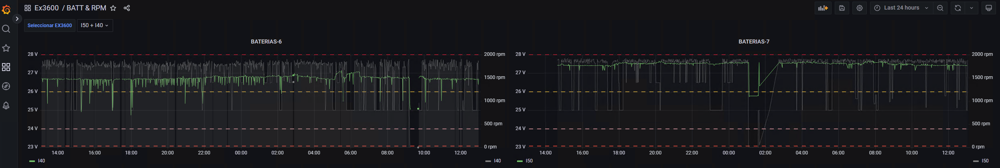
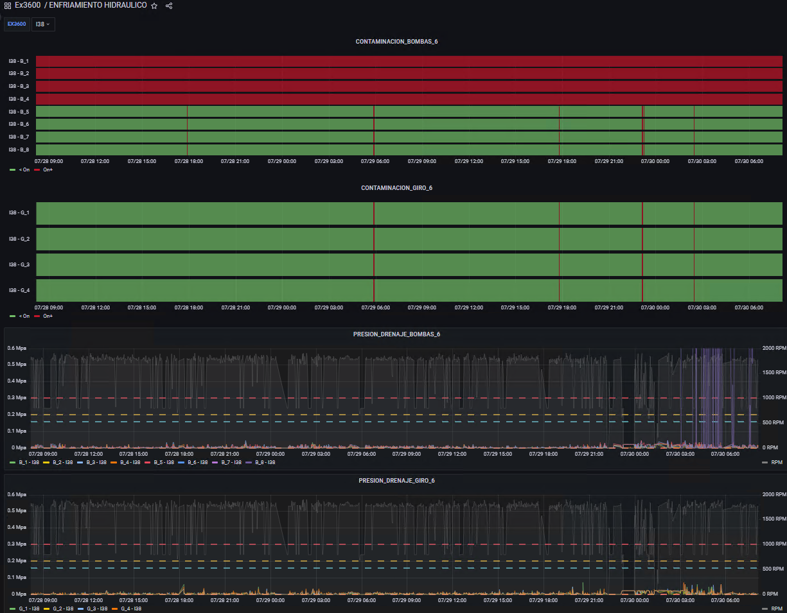
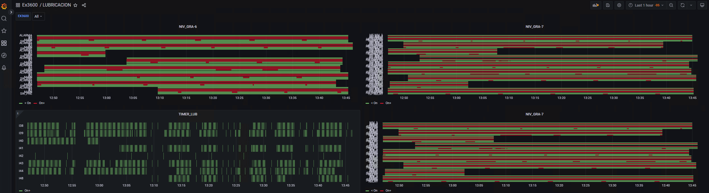
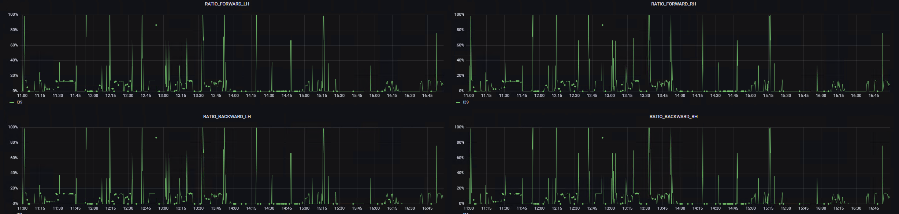

# Set de monitoreo en Grafana — Excavadoras EX3600

Monitoreo de condición basado en telemetría para una flota de excavadoras hidráulicas
mineras **EX3600**. El proyecto define **28 sets de monitoreo** sobre **6 sistemas** del
equipo, los implementa como dashboards en **Grafana** y los convierte en informes
accionables para el área de **Confiabilidad**, que genera las órdenes de trabajo.

> **Estado del plan:** 16 de 28 sets terminados (57 %) · 4 en proceso · 8 pendientes
> · corte 07-08-2026

---

## El problema

En operación minera, la falla de una excavadora de este porte detiene todo un frente de
carguío. El mantenimiento reactivo (esperar la alarma en cabina o el reporte del operador)
llega tarde: cuando el operador reporta pérdida de fuerza, el desgaste interno de la bomba
ya ocurrió.

La telemetría del equipo ya existía, pero **estaba disponible como dato crudo**, no como
información: nadie iba a revisar miles de puntos de presión de drenaje para encontrar el
cruce de un umbral.

## Qué se construyó

Un set de monitoreo que traduce cada variable de telemetría en tres cosas concretas:

1. **Una visualización** en Grafana con sus umbrales críticos ya parametrizados.
2. **Una interpretación técnica** — qué significa físicamente que la variable se comporte así.
3. **Una salida** — la acción de mantenimiento específica que se solicita en la orden de trabajo.

El hallazgo se detecta **por cruce del límite crítico**, no por revisión del dato crudo.
Cada panel está parametrizado por equipo (I38–I57), lo que permite comparar la flota
completa y aislar el equipo afectado en la misma vista.

---

## Alcance del monitoreo

| Sistema | Sets | Terminado | En proceso | Pendiente | Ejemplos de variables |
|---|:--:|:--:|:--:|:--:|---|
| **Eléctrico** | 5 | 5 | — | — | Carga de baterías vs RPM, alternador bajo carga, nivel y porcentaje real de combustible |
| **Hidráulico** | 6 | 4 | 2 | — | Detectores magnéticos de limalla, presión de drenaje de carcasa, descarga de bombas, delta térmico de enfriadores |
| **Potencia** | 6 | — | — | 6 | Presión de cárter (blow-by), EGT por bancada, presión de aceite vs RPM, boost pressure |
| **PTO** | 2 | 2 | — | — | Temperatura y nivel de aceite de la transmisión de bombas |
| **Lubricación** | 3 | 3 | — | — | Alternancia de bombas de grasa, ciclo de presurización, selector de intervalo |
| **Operacional** | 6 | 2 | 2 | 2 | Histéresis del varillaje, ralentí, contragiro LH/RH, ratio de traslación |
| **Total** | **28** | **16** | **4** | **8** | |

**Cronograma de cierre:** 30-jun-2026 (11 sets) · 27-jul-2026 (5) · 06-ago-2026 (4) · 30-ago-2026 (8)

---

## Del dato a la orden de trabajo

```
  Dashboard          Umbral            Hallazgo          Orden de           Cierre
  en Grafana    →    cruzado      →    documentado  →    trabajo       →    y verificación
                                                         (Confiabilidad)
```

Tres ejemplos reales de la salida del monitoreo:

| Sistema · Set | Qué muestra el dashboard | Criticidad | Acción solicitada en la OT |
|---|---|:--:|---|
| Hidráulico · Drenaje | Presión de carcasa sostenida sobre **0,3 MPa** bajo carga: exceso de fugas internas cruzadas (*blow-by*), riesgo de estallido del sello del eje | Crítica | Aislar la bomba en plataforma y ejecutar *Case Drain Flow Test* para confirmar y programar el cambio preventivo (PCR) |
| Eléctrico · Baterías | Caídas de voltaje bajo **24 V** correlacionadas con pérdida intermitente de telemetría por reinicio del ECM | Alta | *Load test* del banco de baterías; revisión de densidad de electrolito, celdas internas y torque/limpieza de bornes |
| Lubricación · Ciclo | Tiempo en ON **mayor a 60 s**: la bomba no alcanza los 3200 psi de corte (tambor vacío, aire en el sistema o línea reventada) | Media | Revisar nivel del barril, purgar la bomba y seguir la línea principal buscando manguera rota |

El informe se emite con la evidencia gráfica del dashboard adjunta. Confiabilidad valida
el hallazgo, define la prioridad y genera la OT; el cierre se verifica sobre el mismo panel.

---

## Dashboards implementados

**Baterías — carga vs RPM con umbrales de 24 V / 26 V / 28 V (ventana de 24 h, dos equipos en paralelo)**



**Contaminación y drenaje — detectores magnéticos en alarma (rojo) sobre las bombas 1 a 4 y presión de carcasa contra el umbral de 0,3 MPa**



**Lubricación — alternancia de las bombas de grasa, alarmas de nivel y timer del ciclo de engrase**



**Traslación — ratio de avance y retroceso LH vs RH; la asimetría revela desgaste del motor de traslación, frenos que no liberan o cadenas sobretensadas**



Las 29 capturas están en [`GRAFICAS/`](GRAFICAS/), organizadas por sistema.

---

## Entregables

| Archivo | Qué es |
|---|---|
| `Dashboard_Set_Monitoreo_EX3600.html` | **Dashboard interactivo autocontenido.** Un solo archivo, sin dependencias ni conexión: KPIs, avance por sistema, cronograma, tabla filtrable de los 28 sets con interpretación y salida desplegables, y galería ampliable de las 29 capturas. |
| `Set_de_monitoreo_Grafana_EX3600.pptx` | Presentación de 4 diapositivas: ruta del plan, dashboards implementados y salida hacia Confiabilidad. |
| `Set de monitoreo - Grafana.docx` | Documento maestro: la matriz completa de sistema, set, visualización, unidad, interpretación, salida, estado y fecha. |
| `GRAFICAS/` | Capturas originales de los dashboards en producción. |

### Ver el dashboard

Descarga `Dashboard_Set_Monitoreo_EX3600.html` y ábrelo con doble clic — funciona en
cualquier navegador, sin servidor y sin internet.

Para publicarlo en línea: activa **GitHub Pages** en `Settings → Pages → Deploy from a
branch → main / (root)`. Queda disponible en:

```
https://<usuario>.github.io/<repositorio>/Dashboard_Set_Monitoreo_EX3600.html
```

---

## Estructura del repositorio

```
.
├── GRAFICAS/
│   ├── Sis_Electrico/        ANGULO · BATERIA · COMBUSTIBLE
│   ├── Sis_Hidraulico/       CONTAMINACION · DRENAJE · PTO
│   ├── Sis_Lubricacion/
│   ├── Sis_Operacion/
│   ├── Sis_Potencia/
│   └── Sis_Traslacion/
├── Set de monitoreo - Grafana.docx
├── Set_de_monitoreo_Grafana_EX3600.pptx
├── Dashboard_Set_Monitoreo_EX3600.html
└── README.md
```

## Herramientas

**Grafana** para la visualización de la telemetría · **HTML / CSS / JavaScript** sin
frameworks para el dashboard autocontenido (imágenes incrustadas en base64/WebP) ·
**Python** (`python-docx`, `Pillow`) para generar el dashboard a partir del documento
maestro y optimizar las capturas.

## Próximos pasos

- **Sistema de Potencia** (6 sets, objetivo 30-ago-2026) — presión de cárter, EGT por
  bancada, presión de aceite, admisión, refrigeración y suministro de combustible.
- **Enfriadores hidráulicos** (2 sets, en proceso) — delta térmico entrada/salida y
  contrapresión de la línea de retorno.
- **Comportamiento operacional** — ralentí prolongado y contragiro, con realimentación
  hacia Entrenamiento Mina.
- Alertas automáticas en Grafana que disparen la notificación a Confiabilidad sin
  revisión manual del panel.

---

## Autor

**Harol Enrique Díaz Meléndez** — diseño del set de monitoreo, implementación de los
dashboards en Grafana e integración con el proceso de Confiabilidad.
